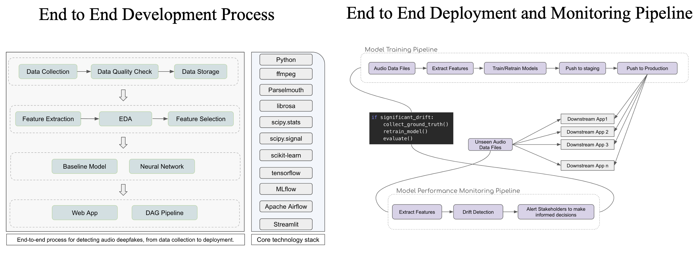

# Audio Deepfake Detection System

The Audio Deepfake Detection System is a comprehensive solution designed to detect and monitor synthetic audio, commonly known as deepfakes. The system uses detailed feature extraction, effective machine learning techniques and a robust architecture that enables both high detection accuracy and adaptability to emerging deepfake technologies.

Key components of the system include:

* Comprehensive Data Handling: The system is built to manage large volumes of audio data efficiently, ensuring high-quality data processing from initial collection through to storage and feature extraction.

* Robust Feature Engineering: Leveraging both time-domain and frequency-domain features, the system is finely tuned to capture the nuances of audio signals, making it highly effective in distinguishing between real and fake audio.

* Advanced Model Training and Deployment: The system utilizes a combination of baseline models and deep learning networks, ensuring that it remains both interpretable and powerful. Deployed models are integrated into a larger system, where they are accessible through a user-friendly web interface and can be utilized across various applications.

* Continuous Monitoring and Adaptation: The system features a dynamic monitoring pipeline that tracks model performance in real-time. It automatically detects data drift and triggers model retraining when necessary, ensuring that the system adapts to new types of deepfake threats over time.

